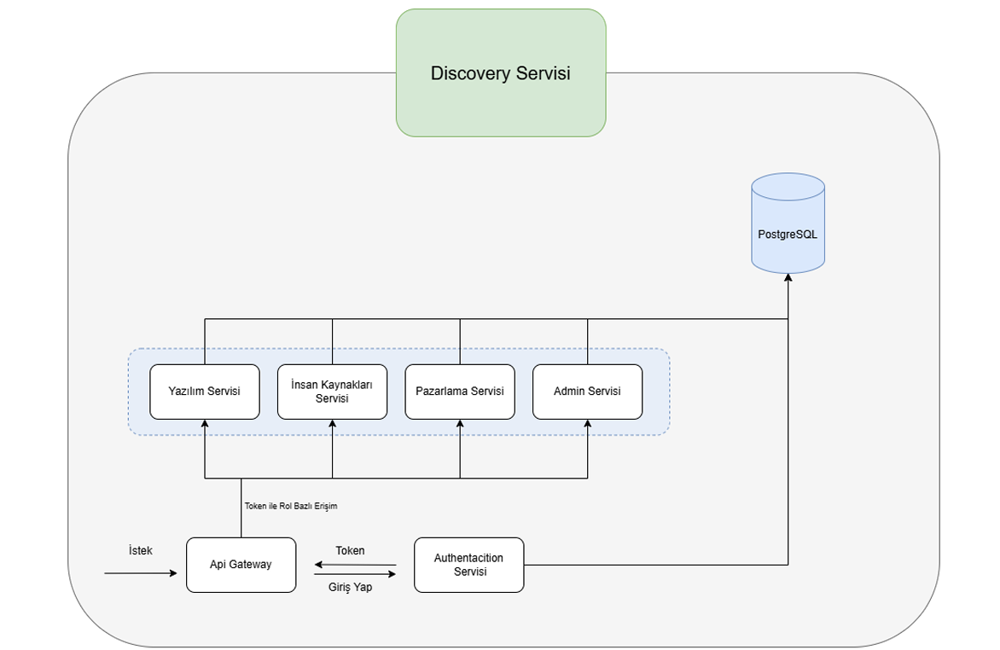

# Job Tracking Application

**Enterprise Business Process Digitalization with Microservices-Based Solution**

A comprehensive job tracking and management application developed using modern microservices architecture and Spring Cloud technologies. Designed to manage, analyze, and optimize business processes of different departments (Human Resources, Marketing, Software, Management) through a centralized platform.

## System Architecture

This application is developed using **Microservices Architecture**:



### 🔧 Technologies Used

- **Backend**: Java, Spring Boot, Spring Cloud
- **Database**: PostgreSQL
- **Service Discovery**: Netflix Eureka
- **API Gateway**: Spring Cloud Gateway
- **Security**: Spring Security, JWT
- **ORM**: Spring Data JPA, Hibernate
- **Build Tool**: Maven
- **Logging**: Log4j2
- **Documentation**: Swagger/OpenAPI

## Microservices Details

### 1. **Discovery Service** (Port: 9000)
- **Technology**: Netflix Eureka Server
- **Purpose**: Registration center for all microservices
- **Features**: 
  - Service discovery and registration
  - Service status monitoring
  - Eureka Dashboard

### 2. **API Gateway** (Port: 8500)
- **Technology**: Spring Cloud Gateway
- **Purpose**: Entry point for all requests
- **Features**:
  - JWT token authentication (AuthFilter)
  - Route management
  - Load balancing
  - CORS management

### 3. **Authentication Service** (Port: 9100)
- **Technology**: Spring Security, JWT
- **Purpose**: Authentication and authorization
- **Endpoints**:
  - `POST /api/auth/login` - Login
  - `POST /api/auth/register` - Registration
  - `GET /api/auth/validate/{token}` - Token validation
  - `GET /api/auth/get-user-info` - User information
  - `GET /api/auth/get-current-user` - Current user

### 4. **Admin Service** (Port: 8000)
- **Purpose**: Central management and coordination
- **Features**:
  - Communication with other services (RestTemplate Client)
  - User management
  - Permission approval/rejection
  - Campaign management
  - Task analysis and reporting

### 5. **HR Service** (Port: 8001)
- **Purpose**: Human Resources processes
- **Endpoints**:
  - `POST /api/user/save` - Add user
  - `PUT /api/user/update/{id}` - Update user
  - `DELETE /api/user/delete/{id}` - Delete user
  - `GET /api/user/get/{id}` - Get user information
  - `GET /api/user/role/{role}` - Get users by role
  - `POST /api/hr/permission/save` - Permission request
  - `GET /api/hr/permission/get/{id}` - Get permission information

### 6. **Marketing Service** (Port: 8002)
- **Purpose**: Marketing campaign management
- **Features**: Redis cache integration
- **Endpoints**:
  - `POST /api/campaign/save` - Create campaign
  - `GET /api/campaign/get/{id}` - Get campaign information
  - `GET /api/campaign/get-all` - Get all campaigns
  - `PUT /api/campaign/update/{id}` - Update campaign
  - `PUT /api/campaign/update-status` - Update status
  - `DELETE /api/campaign/delete/{id}` - Delete campaign

### 7. **Software Service** (Port: 8003)
- **Purpose**: Software projects and task management
- **Features**:
  - Task status tracking
  - Performance analysis and reporting
  - Comment system
- **Endpoints**:
  - `POST /api/task/create` - Create task
  - `PUT /api/task/update-status` - Update task status
  - `GET /api/task/get/{id}` - Get task information
  - `GET /api/task/get-task-by-status` - Get tasks by status
  - `GET /api/task/get-task-by-assignee/{id}` - Get assigned tasks
  - `GET /api/task/get-task-completion-rate/{userId}` - Get completion rate
  - `GET /api/task/get-task-status-analysis/{id}` - Get status analysis
  - `POST /api/comment/save` - Add comment

## User Roles

- **ADMIN**: System administrator (all permissions)
- **HUMAN_RESOURCE**: Human Resources personnel
- **MARKETING**: Marketing personnel
- **SOFTWARE**: Software developer

## Installation and Setup

### Requirements
- Java 17+
- Maven 3.6+
- PostgreSQL 12+
- Git

### Database Setup
```sql
CREATE DATABASE job_tracking_db;
```

### Service Startup Order

1. **Discovery Service** (Must be started first):
```bash
cd discovery
mvn spring-boot:run
```

2. **Authentication Service**:
```bash
cd authentacition
mvn spring-boot:run
```

3. **API Gateway**:
```bash
cd api-gateway
mvn spring-boot:run
```

4. **Other services**:
```bash
# Admin Service
cd admin-service && mvn spring-boot:run

# HR Service  
cd hr-service && mvn spring-boot:run

# Marketing Service
cd marketing-service && mvn spring-boot:run

# Software Service
cd software-service && mvn spring-boot:run
```

## Monitoring and Dashboard

- **Eureka Dashboard**: http://localhost:9000
- **Gateway Health**: http://localhost:8500/actuator/health
- **Service Health**: `/actuator/health` for each service

## Configuration

In each service's `application.yml` file:
- Database connection (PostgreSQL)
- Eureka server address
- Port numbers
- JWT secret key

## Features

- **User Management**: CRUD operations, role-based access
- **Task Tracking**: Status management, assignment, analysis
- **Campaign Management**: Creation, update, status tracking
- **Permission System**: Request, approval/rejection processes
- **Analytics**: Task completion rates, status analysis

---

**Note**: This project is developed for educational purposes and should be reviewed for security, performance, and scalability before use in production environments.
